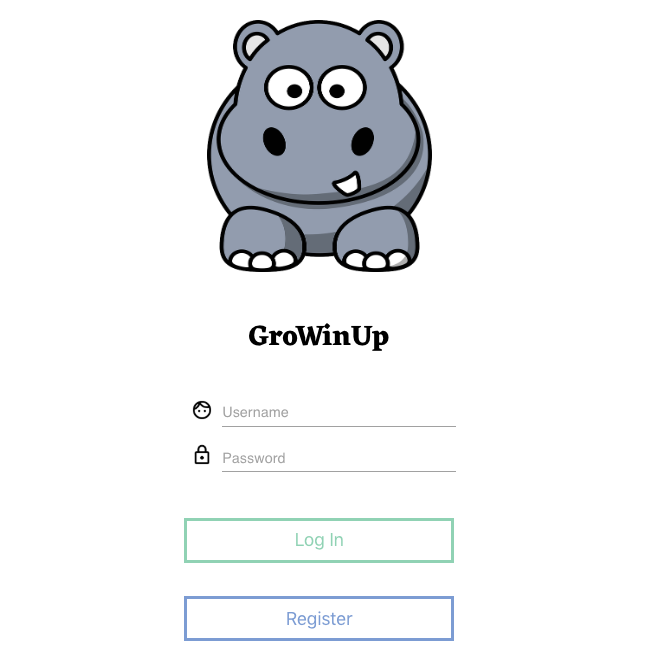
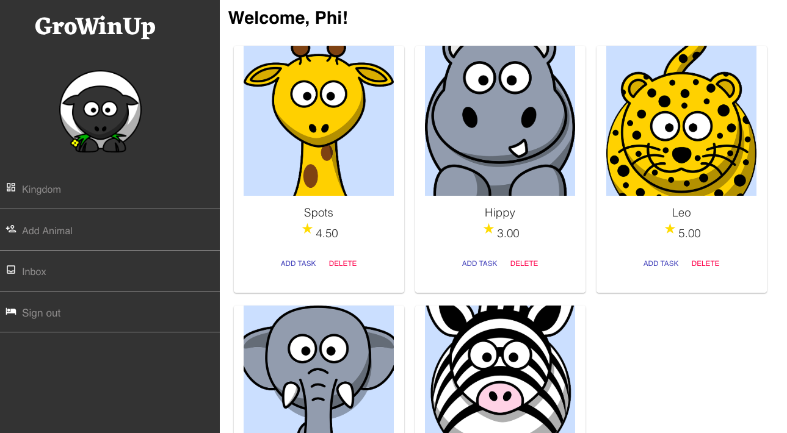

# GroWinUp
GroWinUp was created and developed with parents and children in mind.  Household chores and tasks can now be tracked all in one web application.  The mission was to get children excited and feel responsible by providing them with real time feedback and positive reinforcement. Multiple user integration includes an admin and user feature which gives pre-determined access to parents and children.

## Built With

* ReactJS
* Redux
* Saga
* JavaScript
* Node
* Express
* PostgreSQL
* Material UI
* SweetAlert2

## Getting Started

### Prerequisites

Before you get started, make sure you have the following software installed on your computer:

- Download this project
- [Node.js](https://nodejs.org/en/)
- [PostrgeSQL](https://www.postgresql.org/)
- [Nodemon](https://nodemon.io/)

### Create Database and Table
Create a new database called GroWinUp and create a person, admin_user, user_task, and task table:

```SQL
CREATE TABLE person (
    id SERIAL PRIMARY KEY,
    username VARCHAR(80),
    password VARCHAR(1000),
    profile_image VARCHAR(80),
    admin BOOLEAN
);

CREATE TABLE admin_user (
    id SERIAL PRIMARY KEY,
    admin_id INT REFERENCES person,
    user_id INT REFERENCES person
);

CREATE TABLE user_task (
    id SERIAL PRIMARY KEY,
    task_id INT REFERENCES task,
    user_id INT REFERENCES person,
    completed BOOLEAN,
    rating INT,
    feedback VARCHAR(1000),
    coin INT,
    task_image VARCHAR(80),
    giphy_badge VARCHAR(80)
);

CREATE TABLE task (
    id SERIAL PRIMARY KEY,
    task_name VARCHAR(80)
);
```

### Installing
* Start postgres if not running already by using `brew services start postgresql`
* Run `npm run server`
* Run `npm run client`
* Navigate to `localhost:3000`

## Screen Shot



## Completed Features
- [x] Login
- [x] Registration
- [x] Admin/ Parent Landing
- [x] Admin Add Task
- [x] Admin Add New User
- [x] Admin Inbox
- [x] Child Landing
- [x] Child Inbox

## Next Steps
- [ ] Child Badges
- [ ] Coins/ Rewards
- [ ] Enabling of user to edit their avatar
- [ ] Choose your avatar on registration page
- [ ] Ability to click and drag tasks
- [ ] Animations
- [ ] Deploy to Heroku

### Author
* Phi Tran


